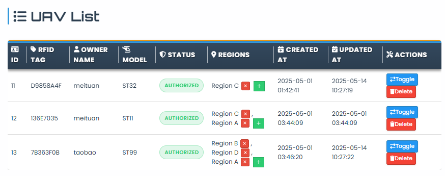

# UAV Docking Management System

A sophisticated, enterprise-grade full-stack application for comprehensive UAV (Unmanned Aerial Vehicle) fleet management, featuring real-time monitoring, intelligent docking operations, advanced analytics, and modern web technologies.



## 🚁 Core Features

### 🎯 UAV Fleet Management

- **Real-time Tracking**: Live GPS monitoring with altitude, speed, heading, and battery status
- **Fleet Overview**: Comprehensive dashboard with status indicators and health metrics
- **Hibernation Management**: Intelligent power management and sleep mode operations
- **Maintenance Scheduling**: Automated maintenance alerts and service tracking
- **Performance Analytics**: Flight efficiency, utilization rates, and operational insights

### 🏢 Docking Station Operations

- **Automated Docking**: Smart docking sequence with collision avoidance
- **Capacity Management**: Real-time availability tracking and queue management
- **Station Health Monitoring**: Equipment status, power levels, and maintenance alerts
- **Multi-station Coordination**: Distributed operations across multiple locations

### 🗺️ Advanced Mapping & Geofencing

- **Interactive Maps**: Real-time UAV visualization with flight path tracking
- **Dynamic Geofencing**: Customizable boundaries with violation detection and alerts
- **Region Management**: Operational zone definition and access control
- **Historical Tracking**: Complete flight history with replay capabilities

### 🔋 Battery & Power Management

- **Real-time Monitoring**: Battery health, charge levels, and performance metrics
- **Predictive Analytics**: Battery life estimation and replacement scheduling
- **Charging Optimization**: Smart charging algorithms and power distribution
- **Alert System**: Low battery warnings and emergency protocols

### 📊 Analytics & Reporting

- **Performance Dashboards**: Real-time KPIs and operational metrics
- **Flight Log Analysis**: Detailed mission reports and efficiency analysis
- **Predictive Maintenance**: AI-driven maintenance scheduling and alerts
- **Data Export**: Multiple format support (CSV, Excel, PDF, JSON) for reporting

### 🔒 Enterprise Security

- **Role-based Access Control**: Multi-level permissions (USER, OPERATOR, ADMIN)
- **JWT Authentication**: Secure token-based authentication with refresh tokens
- **Audit Logging**: Comprehensive security and operation audit trails
- **API Security**: Rate limiting, input validation, and threat protection

## 🛠️ Modern Technology Stack

### 🍃 Backend Technologies

- **☕ Java 21**: Latest LTS with modern language features and performance improvements
- **🍃 Spring Boot 3.x**: Enterprise-grade framework with auto-configuration
- **🔒 Spring Security**: JWT-based authentication with role-based access control
- **📊 GraphQL**: Flexible query language alongside REST APIs for optimal data fetching
- **🌐 WebSocket**: Real-time bidirectional communication for live updates
- **🗄️ JPA/Hibernate**: Advanced ORM with query optimization and caching
- **🐬 MySQL 8.0**: Production database with H2 for development/testing
- **⚡ Redis**: High-performance caching and session storage
- **🧪 JUnit 5 + Mockito**: Comprehensive testing with mocking capabilities
- **📦 Maven**: Dependency management and build automation

### ⚛️ Frontend Technologies

- **⚛️ React 18**: Modern component-based UI with concurrent features
- **🚀 Next.js 15**: Full-stack framework with App Router and server components
- **📘 TypeScript**: Type-safe development with enhanced IDE support
- **🎨 Tailwind CSS**: Utility-first CSS framework for rapid UI development
- **🧩 shadcn/ui**: High-quality component library built on Radix UI primitives
- **🗃️ Zustand**: Lightweight state management with Immer integration
- **🔄 TanStack Query**: Powerful data fetching, caching, and synchronization
- **🎭 Framer Motion**: Production-ready motion library for smooth animations
- **🌐 i18next**: Internationalization with English and Chinese support
- **📋 React Hook Form**: Performant forms with Zod validation
- **📊 Recharts**: Composable charting library for data visualization
- **🗺️ React Leaflet**: Interactive maps with real-time UAV tracking

### 🐳 DevOps & Infrastructure

- **🐳 Docker**: Containerization for consistent deployments across environments
- **🔧 Docker Compose**: Multi-container orchestration for development
- **📝 OpenAPI/Swagger**: Comprehensive API documentation and testing
- **🔍 Checkstyle**: Code quality enforcement and style consistency
- **📊 Structured Logging**: Application, audit, and security log management
- **🛡️ Security Monitoring**: Real-time threat detection and audit trails
- **🧪 Testing Suite**: Unit, integration, and end-to-end testing coverage

## 📚 Comprehensive Documentation

This project includes extensive documentation covering all aspects of the system:

### Core Documentation

- **[API Documentation](docs/API_DOCUMENTATION.md)** - Complete REST and GraphQL API reference with examples
- **[Architecture Guide](docs/ARCHITECTURE.md)** - System design, patterns, data flow, and scalability considerations
- **[Database Schema](docs/DATABASE_SCHEMA.md)** - Detailed database design, relationships, and optimization strategies
- **[Developer Guide](docs/DEVELOPER_GUIDE.md)** - Setup instructions, workflow, testing, and contribution guidelines

### Component Documentation

- **[Backend Services](src/main/java/com/uav/dockingmanagement/service/README.md)** - Service layer architecture and business logic
- **[Frontend Components](frontend/src/components/README.md)** - React component library and usage patterns
- **[API Client Layer](frontend/src/api/README.md)** - Frontend-backend integration and error handling

### API Reference

- **OpenAPI Specification**: [docs/openapi.yaml](docs/openapi.yaml)
- **GraphQL Schema**: [docs/GRAPHQL_API.md](docs/GRAPHQL_API.md)
- **Interactive Documentation**: Available at `/swagger-ui.html` when running
- **GraphQL Playground**: Available at `/graphql`

## 🚀 Quick Start Guide

### 📋 Prerequisites

- **Java 21** or higher (LTS recommended)
- **Node.js 18+** with **pnpm** package manager
- **Docker & Docker Compose** (recommended for development)
- **MySQL 8.0** (if not using Docker)

### ⚡ Instant Setup with Docker (Recommended)

```bash
# 1. Clone the repository
git clone <repository-url>
cd DaChuangBackend

# 2. Start all services (MySQL, Redis, Backend, Frontend)
docker-compose up -d

# 3. View application logs
docker-compose logs -f app

# 4. Access the application
# • Backend API: http://localhost:8080
# • Frontend App: http://localhost:3000
# • API Documentation: http://localhost:8080/swagger-ui.html
# • GraphQL Playground: http://localhost:8080/graphql
# • H2 Console (dev): http://localhost:8080/h2-console
```

### 🛠️ Manual Development Setup

```bash
# Backend setup
./mvnw clean install
./mvnw spring-boot:run

# Frontend setup (in separate terminal)
cd frontend
pnpm install
pnpm dev

# Access applications
# • Backend: http://localhost:8080
# • Frontend: http://localhost:3000
```

### 🧪 Running Tests

```bash
# Backend tests
./mvnw test

# Frontend tests
cd frontend && pnpm test

# Full test suite with coverage
./scripts/test.sh
```

## ⚙️ Configuration

### Database Configuration

**Development (H2)**

```properties
spring.profiles.active=local
spring.datasource.url=jdbc:h2:mem:testdb
spring.jpa.hibernate.ddl-auto=create-drop
```

**Production (MySQL)**

```properties
spring.profiles.active=prod
spring.datasource.url=jdbc:mysql://localhost:3306/uav_management
spring.datasource.username=your_username
spring.datasource.password=your_password
```

### Environment Variables

```bash
# Database
DB_HOST=localhost
DB_PORT=3306
DB_NAME=uav_management
DB_USERNAME=root
DB_PASSWORD=password

# Redis
REDIS_HOST=localhost
REDIS_PORT=6379

# Security
JWT_SECRET=your-secret-key
```

## 📚 API Documentation

### REST Endpoints

#### Location Tracking

- `POST /api/location/update/{uavId}` - Update UAV location
- `GET /api/location/current` - Get all current locations
- `GET /api/location/history/{uavId}` - Location history
- `GET /api/location/flight-path/{uavId}` - Flight path data

#### Docking Stations

- `POST /api/docking-stations` - Create station
- `GET /api/docking-stations/nearest` - Find nearest stations
- `GET /api/docking-stations/available` - Available stations
- `PUT /api/docking-stations/{id}/status` - Update status

#### Geofencing

- `POST /api/geofences` - Create geofence
- `GET /api/geofences/active` - Active geofences
- `GET /api/geofences/check-point` - Check violations

For complete API documentation, see [docs/MAP_API_DOCUMENTATION.md](docs/MAP_API_DOCUMENTATION.md)

### GraphQL

Access GraphQL playground at `/graphql` for flexible data querying.

## 🧪 Testing

```bash
# Run all tests
./mvnw test

# Run specific test class
./mvnw test -Dtest=LocationControllerTest

# Run integration tests
./mvnw verify

# Generate test coverage report
./mvnw jacoco:report
```

## 🐳 Docker Deployment

### Development

```bash
docker-compose up -d
```

### Production

```bash
# Build production image
docker build -t uav-management:latest .

# Run with external database
docker run -d \
  -p 8080:8080 \
  -e SPRING_PROFILES_ACTIVE=prod \
  -e DB_HOST=your-db-host \
  -e DB_USERNAME=username \
  -e DB_PASSWORD=password \
  uav-management:latest
```

## 📊 Monitoring & Logging

- **Application Logs**: `logs/application.log`
- **Audit Logs**: `logs/audit.log`
- **Security Logs**: `logs/security.log`
- **Health Check**: `/actuator/health`
- **Metrics**: `/actuator/metrics`

## 🔒 Security

### Authentication

The system uses role-based authentication with three levels:

- **USER**: Read-only access
- **OPERATOR**: Can update locations and manage operations
- **ADMIN**: Full system access

### API Security

- JWT token-based authentication
- HTTPS enforcement in production
- Input validation and sanitization
- SQL injection protection

## 🤝 Contributing

1. Fork the repository
2. Create a feature branch (`git checkout -b feature/amazing-feature`)
3. Commit your changes (`git commit -m 'Add amazing feature'`)
4. Push to the branch (`git push origin feature/amazing-feature`)
5. Open a Pull Request

### Development Guidelines

- Follow Java coding standards
- Write unit tests for new features
- Update documentation
- Ensure all tests pass before submitting

## 📄 License

This project is licensed under the Apache License 2.0 - see the [LICENSE](LICENSE) file for details.

## 🆘 Support

- **Documentation**: [docs/](docs/)
- **Issues**: Create an issue on GitHub
- **Email**: [Contact Information]

## 🗺️ Roadmap & Future Enhancements

### 🎯 Short-term Goals

- [ ] **CI/CD Pipeline**: Automated testing and deployment workflows
- [ ] **Performance Monitoring**: Application performance monitoring (APM) integration
- [ ] **Enhanced Analytics**: Machine learning insights for UAV operations
- [ ] **Mobile App**: React Native companion app for field operations

### 🚀 Long-term Vision

- [ ] **Microservices Architecture**: Domain-driven service decomposition
- [ ] **Cloud Native Deployment**: Kubernetes orchestration with auto-scaling
- [ ] **AI Integration**: Predictive maintenance and autonomous operations
- [ ] **IoT Expansion**: Integration with additional sensor types and devices
- [ ] **Multi-tenant Support**: Enterprise-grade multi-organization support

---

## 📊 Project Status

This is a **production-ready** application with comprehensive features:

- ✅ **Backend**: Complete Spring Boot application with security, APIs, and real-time features
- ✅ **Frontend**: Modern Next.js application with responsive design and internationalization
- ✅ **Database**: Optimized schema with proper indexing and relationships
- ✅ **Testing**: Comprehensive test coverage for reliability
- ✅ **Documentation**: Extensive documentation for developers and users
- ✅ **DevOps**: Docker containerization and deployment scripts

---

*Built with ❤️ for next-generation UAV fleet management*
